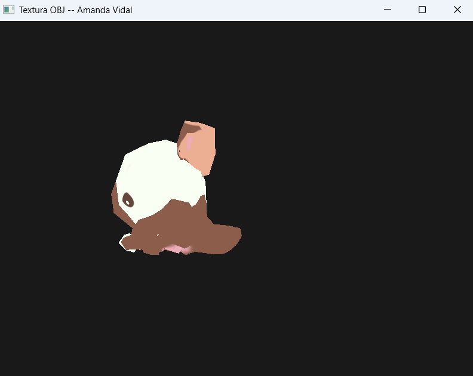
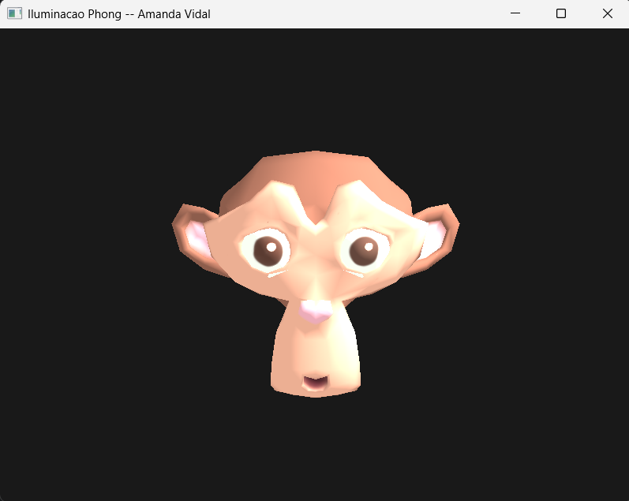
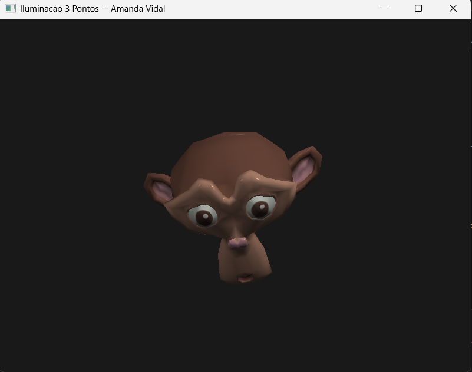
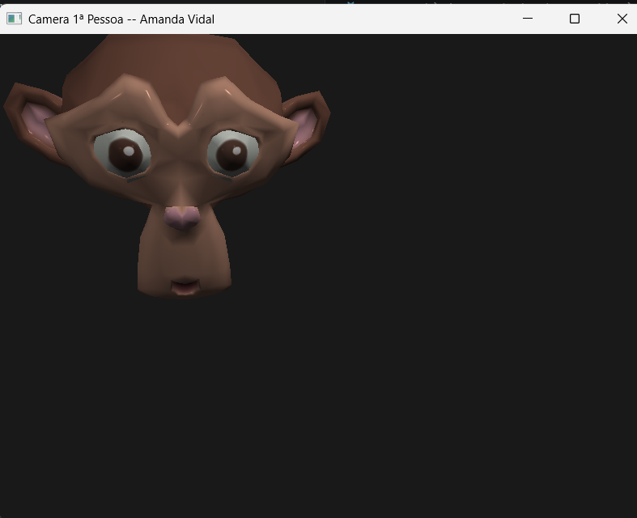
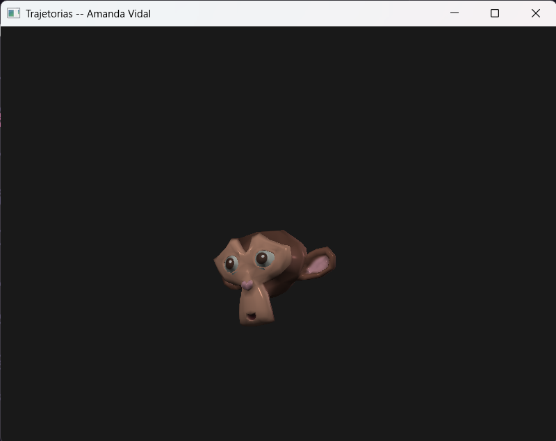

# Resultados dos Exercícios

## Hello3D

### Descrição

Primeiro exercício de gráficos 3D.

### Resultado

## Cube3D

### Descrição

Segundo exercício de gráficos 3D.

### Resultado

## Textura

### Descrição

Terceiro exercício de gráficos 3D.

### Resultado

## Iluminacao

### Descrição

Quarto exercício de gráficos 3D.

### Resultado

## AtividadeVivencial2

### Descrição

Atividade Vivencial 2 de gráficos 3D.

### Resultado

## Câmera

### Descrição

Quinto exercício de gráficos 3D.

### Resultado

## Trajetórias

### Descrição

Sexto exercício de gráficos 3D.

### Resultado

